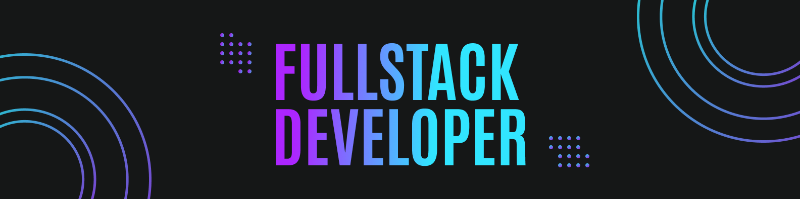

<h1 width="100%;" text-align="center;">
  
</h1>

Olá amigos, tudo bem?! Seja bem vindo ao meu repositório 😎

## Tecnologias

Javascript, Typescript, React JS, Vue JS, Next JS, Node JS, Nest JS, PostgreSQL, MongoDB, SQL, GitHub Actions, GitLab, HTML, CSS.

## Meu Portfólio

https://gabriel-natan.netlify.app/

### 📫 Entre em contato comigo:
-   
